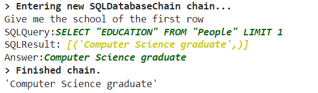
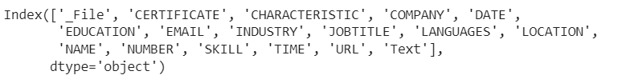

RAG : NL to SQL. 
This project utilizes OpenAI's LLM and Langchain for Retrival Augmented Generation.
The process is : 
* Start with an Excel File containing the data you want to query
* Transform it into a pandas Dataframe so that you can but it into a Mysql database.
* Create an instance of the LLM
* Create an instance of the Agent
* Transform Natural Languge to SQL queries
* Fetech the database and execute this queries
* Return output of these Queries.

